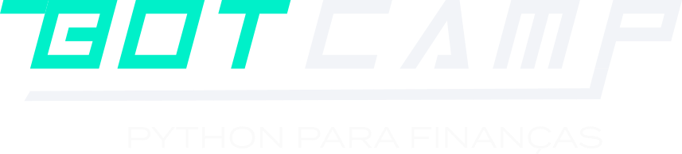

<h1 align="center">
  Botcamp Python para Finanças
</h1>

  

  

  <a href="#-projeto">🖥️ Projeto</a>&nbsp;&nbsp;&nbsp;|&nbsp;&nbsp;&nbsp;
  <a href="#-tecnologias">🚀 Tecnologias</a>&nbsp;&nbsp;&nbsp;|&nbsp;&nbsp;&nbsp;
  <a href="#-license">📝 License</a>

## 💻 Projeto

Os projetos desse repositório foram desenvolvidos para o Botcamp de Python para Finanças da VAROS.

- Projeto 1: Relatório de fechamento de mercado por e-mail - [🔗](./aula-01/main.py)
- Projeto 2: Web Scraping: Dados Financeiros de todos os ETFs do mundo - [🔗](./aula-02/main.py)

## 🚀 Tecnologias

  

## 📝 License

Esse projeto está sob a licença MIT. Veja o arquivo [LICENSE](LICENSE) para mais detalhes.

---
